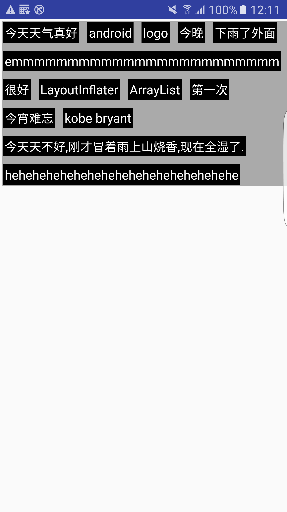
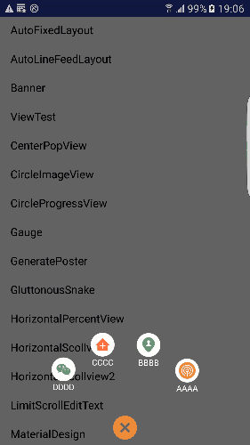
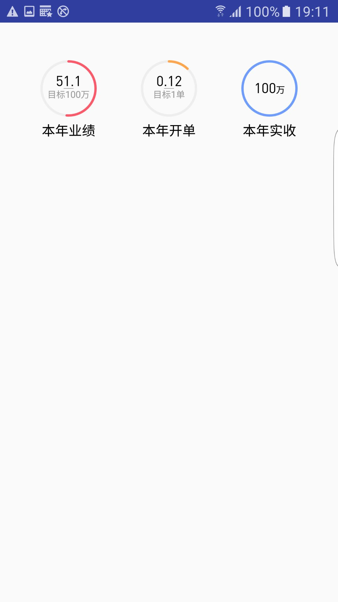
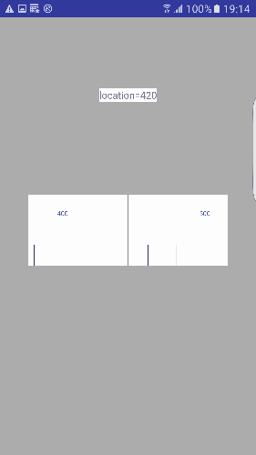
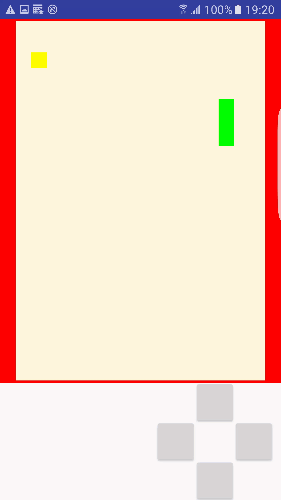
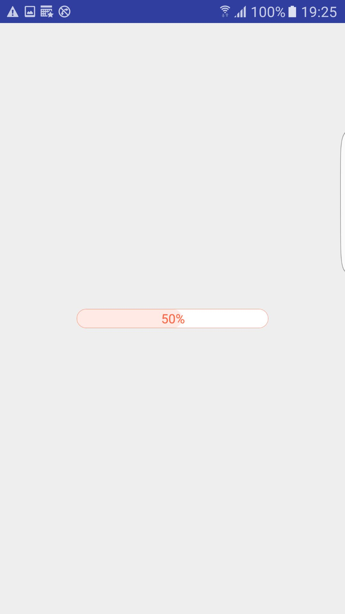
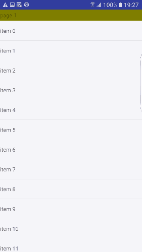
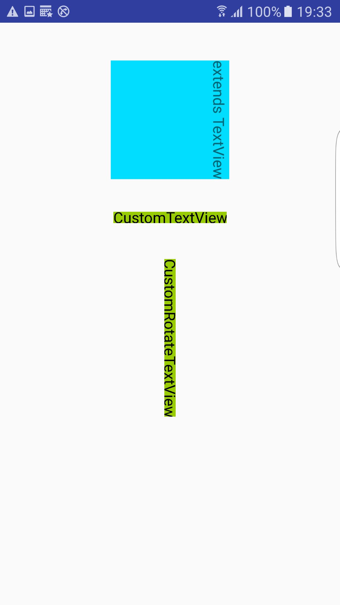
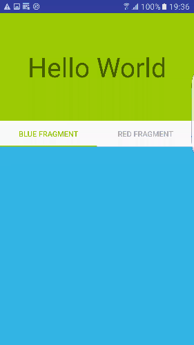
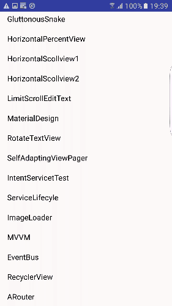

# My demo for learning Android
---

## Demo

以下是部分demo的介绍, 仅供参考.

**1. AutoLineFeedLayout**

可自动换行的布局

 

**2. Banner**

简单易实现的无线循环轮播图

**3. CenterPopView**

有扩散和收缩动画的菜单View

**4. CircleImageView**

圆形头像

**5. CircleProgressView**

中间带文字的圆形进度条

**6. GaugeView**

刻度尺

**7. SnakeView**

贪吃蛇

**8. HorizontalPercentView**

横向百分比View

**9. HorizontalScrollView**

横向滑动的ScrollView, 类似ViewPager

**10. RotateTextView**

方向旋转的TextView

**11. SelfAdaptingViewPager**

高度自适应的ViewPager

**12. ImageLoader**

自定义的简单图片加载器

