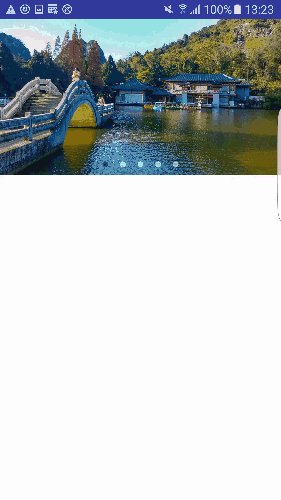

# My demo for learning Android
---

## CustomView

以下是部分自定义View的介绍, 仅供参考.

**1. AutoLineFeedLayout**

description: 可自动换行的布局

display: 

 

**2. banner**

description: 简单易实现的banner, 参考[https://github.com/youth5201314/banner](https://github.com/youth5201314/banner).

display：

